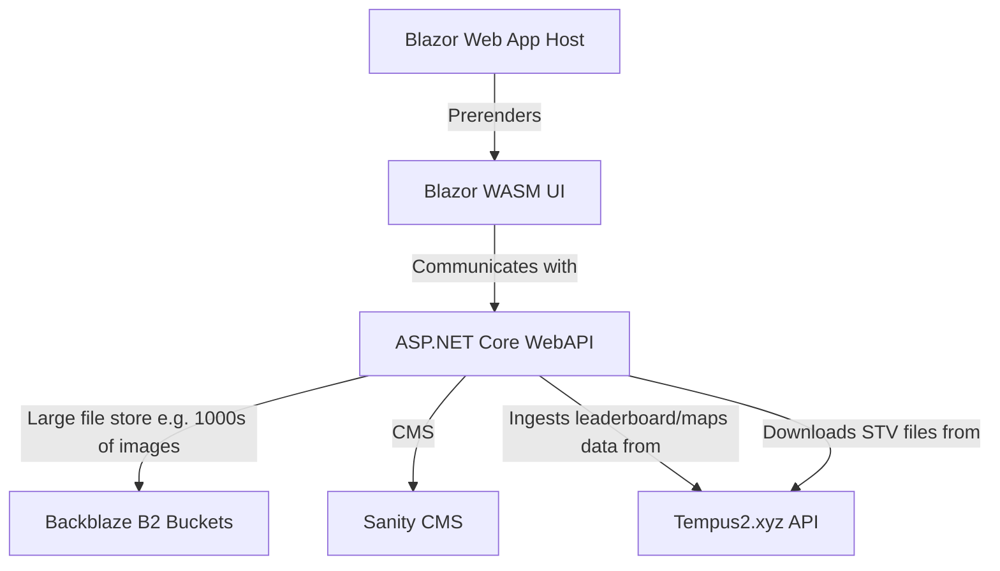

# Architecture

```mermaid
graph TD
    A[Blazor Web App Host] -->|Prerenders| B[Blazor WASM UI]
    B -->|Communicates with| C[ASP.NET Core WebAPI]
    
    C -->|Large file store e.g. 1000s of images| D[Backblaze B2 Buckets]
    C -->|CMS| E[Sanity CMS]
    C -->|Ingests leaderboard/maps data from| F[Tempus2.xyz API]
    C -->|Downloads STV files from| F
```
